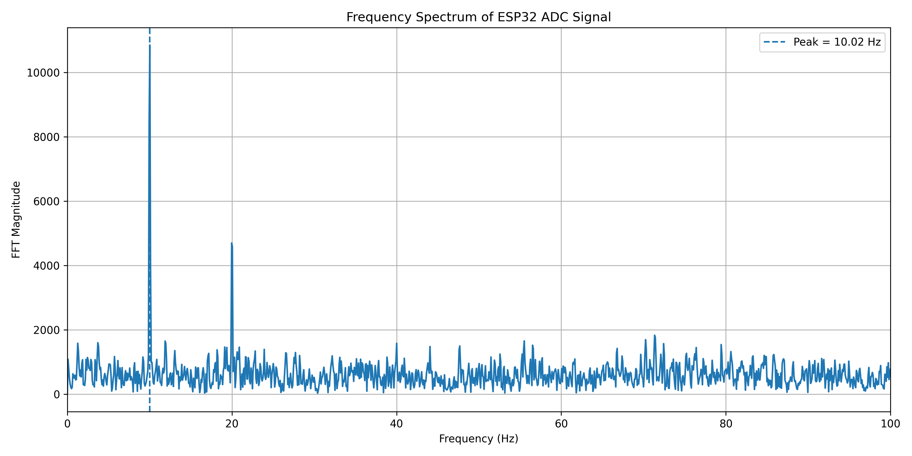

# ESP32 Analog Signal Acquisition & DSP System

A mixed-signal electronics project by Ela Onal: design and characterise an analogue conditioning circuit, acquire its output with an ESP32 ADC, and evaluate embedded filtering and ## Documentation schematic

```text
Generator ── C_AC ── [bias stage: ~1.64 V DC] ── 10 kΩ ──●── GPIO34 ADC
                                                      │
                                                    1 µF
                                                      │
                                                     GND
```

Documentation schematic derived from the circuit values and signal chain documented below; **not a native EDA design or verified wiring drawing**. AC-coupling capacitance and detailed bias-network connections are unspecified in the available documentation. The RC section depicts the first-order low-pass topology for the documented 10 kΩ / 1 µF values, giving a calculated cutoff of approximately 15.9 Hz. Source and load impedances can affect the realised response.

frequency recovery using Python.

## Results and evidence

| Experiment | Reported result | Inspect the evidence |
| --- | --- | --- |
| Acquisition timing | Median interval 2,000 microseconds; 500 Hz sampling | [10 Hz dataset](data/fft_data_10Hz.csv) |
| Frequency recovery | 10.02 Hz dominant FFT peak for a nominal 10 Hz input | [FFT plot](results/fft_10Hz.png) and [analysis](python/fft_analysis.py) |
| Filtering | Raw SD 21.12 ADC counts; moving average 10.42; IIR 9.91 | [Raw/filtered data](data/raw_data.csv) and [analysis](python/analyze_data.py) |
| Analogue filter | Calculated cutoff 15.9 Hz; measured gains listed below | Original bench measurements documented below |




The original experiment also reported a 4.97 Hz recovered component. Its separate raw dataset is not included here. The committed 10 Hz dataset independently reproduces approximately 10.0236 Hz using the documented FFT method. These are bench-project results, not an instrument calibration or a general accuracy specification.

## Signal chain

```text
Signal generator → AC coupling → ~1.64 V DC bias → RC low-pass filter
→ ESP32 GPIO34 ADC → 500 Hz sampling → embedded filters → USB serial
→ Python statistics / FFT / CSV
```

This connects analogue circuit design and circuit testing with embedded software and data analysis. The conditioning stage biases the waveform for ADC acquisition; input amplitude and voltage limits must be checked for the selected ESP32 hardware.

## Hardware and circuit characterisation

ESP32 DevKit, 10 kΩ resistors, 1 µF RC-filter capacitor, AC-coupling capacitor, breadboard and jumper wires; digital multimeter, FNIRSI oscilloscope and signal generator.

For R = 10 kΩ and C = 1 µF, fc = 1/(2πRC) ≈ 15.9 Hz. The documented bench measurements were:

| Frequency | Measured gain |
| ---: | ---: |
| 5 Hz | 0.94 |
| 10 Hz | 0.86 |
| 16 Hz | 0.72 |
| 25 Hz | 0.55 |
| 50 Hz | 0.31 |
| 100 Hz | 0.16 |

The response follows the expected first-order low-pass trend. Raw oscilloscope exports and measurement uncertainties are not included. ADC tests examined voltage response, extrema, peak-to-peak variation and standard deviation.

## Embedded filters and analysis

The firmware implements a five-sample moving average and a first-order IIR filter with alpha = 0.3:

```text
MA[n] = (x[n] + x[n-1] + x[n-2] + x[n-3] + x[n-4]) / 5
IIR[n] = 0.3*x[n] + 0.7*IIR[n-1]
```

| Metric in ADC counts | Raw | Moving average | IIR |
| --- | ---: | ---: | ---: |
| Mean | 1907.07 | 1907.07 | 1907.06 |
| Standard deviation | 21.12 | 10.42 | 9.91 |
| Minimum | 1746 | 1853 | 1857.1 |
| Maximum | 2051 | 1949 | 1956.3 |
| Peak-to-peak | 305 | 96 | 99.2 |

For this dataset, moving-average and IIR filtering reduced SD by approximately 51% and 53%. This quantifies reduced short-term variation; it does not establish improved absolute ADC accuracy.

FFT processing estimates sample rate from timestamp intervals, removes DC, applies a Hann window, computes the real FFT and selects the largest non-DC bin. The 5,936-sample 10 Hz record has approximately 0.0842 Hz bin spacing.

## Reproduce the analysis

Install Python dependencies from the repository root:

```bash
python3 -m pip install -r requirements.txt
python3 python/analyze_data.py
```

The filtering analysis reads data/raw_data.csv and writes results/raw_vs_filtered.png. The existing FFT script reads fft_data.csv from the working directory. To use the committed record:

```bash
cp data/fft_data_10Hz.csv fft_data.csv
python3 python/fft_analysis.py
```

It writes fft_spectrum.png and displays the plot. Copy only when no existing fft_data.csv needs to be retained, or change the script FILE setting to the committed dataset.

## Capture a new experiment

- Upload [dsp_filters.ino](firmware/dsp_filters.ino) for the filtering experiment or [fft_acquisition.ino](firmware/fft_acquisition.ino) for FFT acquisition.
- Set the actual serial-port name in [serial_capture.py](python/serial_capture.py) or [fft_capture.py](python/fft_capture.py); close other serial monitors before capture.
- The capture scripts write files in the working directory. Preserve the example data and deliberately select the new file for analysis.
- Use [check_fft_data.py](python/check_fft_data.py) to inspect timestamp consistency after checking its input filename.

## Repository guide

- [firmware](firmware): acquisition and embedded filtering.
- [python](python): capture, statistics, FFT and timestamp checks.
- [data](data): committed measurements.
- [results](results): filtering and FFT plots.
- [requirements.txt](requirements.txt): Python dependencies.
