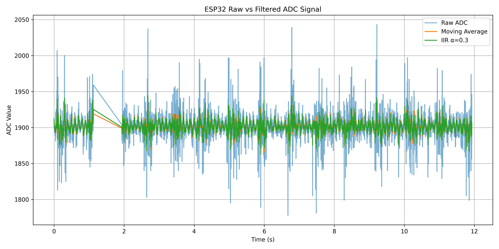

# ESP32 Analog Signal Acquisition & DSP System

A mixed-signal embedded systems project combining analog signal conditioning, ESP32 ADC acquisition, digital filtering, and Python-based statistical and FFT analysis.

## Project Overview

The system acquires a real analog waveform, conditions it for safe ESP32 ADC operation, applies analog filtering, samples the signal at a controlled rate, performs digital filtering in embedded C/C++, and transfers the data to Python for analysis.

The complete signal chain is:

```text
Signal Generator
      ↓
AC Coupling
      ↓
1.64 V DC Bias
      ↓
RC Low-Pass Filter
      ↓
ESP32 GPIO34 ADC
      ↓
500 Hz Sampling
      ↓
Moving Average + IIR Filtering
      ↓
USB Serial
      ↓
Python
      ↓
CSV / Statistics / FFT
## Hardware

- ESP32 DevKit
- 10 kΩ resistors
- 1 µF capacitor
- AC coupling capacitor
- Breadboard
- Jumper wires
- Digital multimeter
- FNIRSI oscilloscope
- FNIRSI signal generator
- MacBook

ADC input:

```text
GPIO34
## RC Low-Pass Filter

The analog filter uses:

- R = 10 kΩ
- C = 1 µF

The theoretical cutoff frequency is:

fc = 1 / (2πRC)

Therefore:

fc ≈ 15.9 Hz

The filter was tested experimentally using the signal generator and oscilloscope.

Measured gain values:

| Frequency | Measured Gain |
|---:|---:|
| 5 Hz | 0.94 |
| 10 Hz | 0.86 |
| 16 Hz | 0.72 |
| 25 Hz | 0.55 |
| 50 Hz | 0.31 |
| 100 Hz | 0.16 |

The measured response closely followed the expected first-order RC low-pass filter behaviour.
## ESP32 ADC Acquisition

The conditioned analog signal was sampled through ESP32 GPIO34.

The ADC was tested using controlled voltage inputs and analysed for:

- Raw ADC values
- Voltage response
- Minimum and maximum readings
- Peak-to-peak variation
- Standard deviation
- ADC noise

## Controlled Sampling

The sampling interval was set to:

2000 µs

which corresponds to:

500 Hz

Python analysis confirmed:

```text
Median sampling interval: 2000.0 µs
Measured sampling frequency: 500.0 Hz
## Digital Filtering

Two digital filters were implemented directly on the ESP32.

### Moving Average Filter

A five-sample moving-average filter was used to reduce short-term ADC variation.

```text
y[n] = (x[n] + x[n-1] + x[n-2] + x[n-3] + x[n-4]) / 5
y[n] = αx[n] + (1-α)y[n-1]
α = 0.3
## Digital Filtering Results

Python was used to compare the raw ADC signal with the moving-average and IIR filtered outputs.

| Metric | Raw ADC | Moving Average | IIR α=0.3 |
|---|---:|---:|---:|
| Mean | 1907.07 | 1907.07 | 1907.06 |
| Standard deviation | 21.12 | 10.42 | 9.91 |
| Minimum | 1746 | 1853 | 1857.1 |
| Maximum | 2051 | 1949 | 1956.3 |
| Peak-to-peak | 305 | 96 | 99.2 |

The moving-average filter reduced standard deviation by approximately 51%.

The IIR filter reduced standard deviation by approximately 53%.

Peak-to-peak variation was reduced by approximately 68%.

The mean signal level remained almost unchanged, showing that the filters reduced short-term variation without significantly shifting the signal.

## Raw vs Filtered Signal


## FFT Frequency Analysis

Python FFT analysis was used to identify the dominant frequency of the acquired analog waveform.

Processing sequence:

```text
ADC Samples
    ↓
Remove DC Offset
    ↓
Apply Hann Window
    ↓
FFT
    ↓
Frequency Spectrum
    ↓
Dominant Frequency Detection
Measured sampling frequency: 500.0 Hz
Detected dominant frequency: 10.02 Hz
FFT frequency resolution: 0.0842 Hz
≈ 0.2%
Detected dominant frequency: 4.97 Hz
## Repository Structure

```text
ESP32-Analog-Signal-Acquisition-DSP/
│
├── firmware/
│   ├── dsp_filters.ino
│   └── fft_acquisition.ino
│
├── python/
│   ├── serial_capture.py
│   ├── analyze_data.py
│   ├── fft_capture.py
│   ├── fft_analysis.py
│   └── check_fft_data.py
│
├── data/
│   ├── raw_data.csv
│   └── fft_data_10Hz.csv
│
├── results/
│   ├── raw_vs_filtered.png
│   └── fft_10Hz.png
│
├── docs/
├── requirements.txt
├── .gitignore
└── README.md
## Python Scripts

### `serial_capture.py`

Receives ESP32 data through USB serial and stores it in CSV format.

### `analyze_data.py`

Performs:

- Sampling-rate calculation
- Mean calculation
- Standard deviation
- Minimum and maximum analysis
- Peak-to-peak analysis
- Raw vs filtered signal plotting

### `fft_capture.py`

Captures raw ADC samples for FFT experiments.

### `fft_analysis.py`

Performs:

- DC offset removal
- Hann windowing
- FFT
- Frequency-axis generation
- Dominant-frequency detection
- Spectrum plotting

### `check_fft_data.py`

Checks timestamp consistency and identifies abnormal sampling intervals.

## Python Dependencies

Install the required packages using:

```bash
pip3 install -r requirements.txt
numpy
pandas
matplotlib
pyserial
## Running the DSP Acquisition

Upload:

```text
firmware/dsp_filters.ino